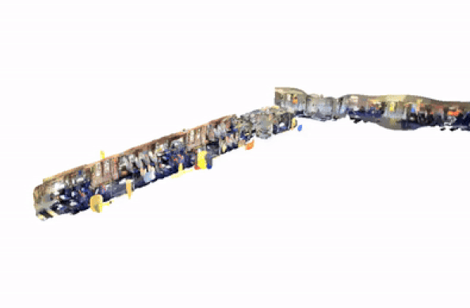
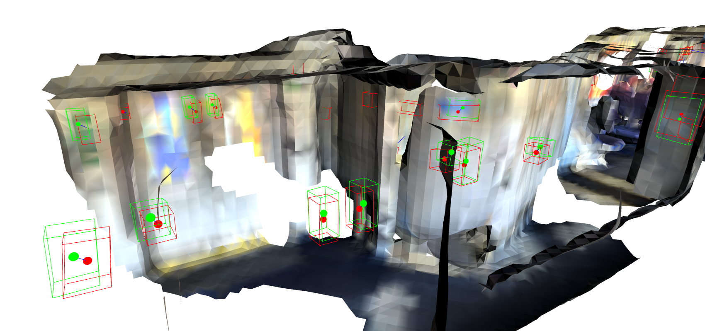

# Mapping and Localisation of Objects-of-Interest in 3D Point Clouds - Innovate UK AKT Project

 &emsp;
 &emsp;
 &emsp;
 &emsp;
 &emsp;
 &emsp;

## Table of Contents

- [Localisation and Mapping of Signage on Train Vehicles - Innovate UK AKT Project](#localisation-and-mapping-of-signage-on-train-vehicles---innovate-uk-akt-project)
  - [Bespoke Algorithms](#bespoke-algorithms)
  - [Open-Source Usage](#open-source-usage)

This was an Innovate UK AKT project that was a collaboration between the University of Southampton and an industry client. Due to the sensitive nature of the use case, this repository contains a streamlined version focused exclusively on the technical achievements of the project. The primary goals of the project were:

- **Curating a Bespoke Dataset**
  - Acquired on-site with real-world data, which formed the basis for testing and validating the solution.
- **Self-Localization, Detection, and Mapping on Mobile Devices**
  - Implemented using open-source software integrated into the backend processing pipeline.
- **Detection and Labelling in 3D Point Clouds**
  - Finetuned pretrained computer vision models and developed machine learning techniques to accurately map items within point clouds.
- **Prototyping the Clients Product**
  - Developed a system to detect missing and damaged objects-of-interest, essential for the client’s business processes.

  
   
  <em>RTAB-Map Generated LiDAR scan of vehicle interior.</em>

Beyond these core objectives, we delivered a strategic roadmap to guide our clients in transitioning to a data-driven organization. This roadmap included recommendations on integrating the developed technologies, adopting data-driven decision-making practices, and scaling product deployment for maximum impact.

The AKT project not only met its initial goals but also positioned our client for future growth and innovation by equipping them with the necessary tools, insights, and strategic direction to achieve their long-term objectives.

## Bespoke Algorithms

1. **2D Object Detection Bounding Box Transform to 3D Space** - this algorithm extends 2D object detection by projecting the bounding boxes into 3D space. It converts 2D pixel coordinates from the depth image to 3D space coordinates such that it can estimate the real-world positions of objects.

<table style="width: 100%;">
  <tr>
    <td align="center" style="width: 50%;">
      
    </td>
    <td align="center" style="width: 50%;">
      
    </td>
  </tr>
  <tr>
    <td colspan="2" align="center">
      <em>Processed 3D objects of interest, localized in the global space.</em>
    </td>
  </tr>
</table>

2. **Map Alignment Algorithm** - the map alignment algorithm is designed to accurately align the gold-standard and comparison map representations. It employs image processing and machine learning techniques to perform the alignment.

  
   
  <em>Alignment of 2 separate 3D point clouds using our algorithm.</em>

3. **Bounding Box Bipartite Matching for Missing Box Identification** - this algorithm addresses the problem of identifying missing objects of interest by comparing two scans. It employs a bipartite matching approach to pair detected bounding boxes from one scan with those from another scan.

  
   
  <em>Bounding box matching between objects of interest in Scan 1 (red) and Scan 2 (green).</em>

## Open-Source Usage
- 3D open-source SLAM algorithms utilise RTAB-Map [1]
- The object detection model is a finetuned YOLOv10 model [2]
- The image classification model is a finetuned BEiT model [3]

### References

[1] Labbé, M. and Michaud, F., 2019. RTAB‐Map as an open‐source lidar and visual simultaneous localization and mapping library for large‐scale and long‐term online operation. Journal of field robotics, 36(2), pp.416-446.  
[2] Wang, A., Chen, H., Liu, L., Chen, K., Lin, Z., Han, J. and Ding, G., 2024. Yolov10: Real-time end-to-end object detection. arXiv preprint arXiv:2405.14458.  
[3] Bao, H., Dong, L., Piao, S. and Wei, F., 2021. Beit: Bert pre-training of image transformers. arXiv preprint arXiv:2106.08254.
