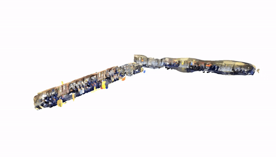

# Localisation and Mapping of Signage on Train Vehicles - Innovate UK ATK Project

  
   
    <em>RTAB-Map Generated LiDAR scan of vehicle interior.</em>

<table style="width: 100%;">
  <tr>
    <td align="center" style="width: 50%;">
      
    </td>
    <td align="center" style="width: 50%;">
      
    </td>
  </tr>
  <tr>
    <td colspan="2" align="center">
      <em>Processed 3D  and signs localised in the global space.</em>
    </td>
  </tr>
</table>

  
   
    <em>Alignment of 2 separate 3D point clouds using our algorithm.</em>

## Usage

### Data Folder Setup

1. **Create a New Folder**: Create a new folder with `<folder_name>` in the `src/common/data` directory.
2. **Place the .db File**: Put the `.db` file in this folder and name it `data.db`.
3. **Navigate to Root**: Change directory back to the root of the project.
4. **Run the Shell Script**:
    - Use `./run.sh --setup --data <folder_name>` if running for the first time.
    - Use `./run.sh --data <folder_name>` for subsequent runs.

 

> **Note**: If you use the `--setup` flag after the first time, it still works fine, you're just wasting time with setup.

    
Using the RTAB-Map GUI Instead

    You can also use the RTAB-Map GUI to do this manually.

    cd src/common/data/<folder_name>

    Extract Point Cloud
    -------------------------------
    rtabmap-databaseViewer data.db
    Yes
    File -> Export 3D map
    Save

    Extract Pose
    -------------------------------
    File -> Export Poses
    Maps graph (see Graph View)
    Camera

---
